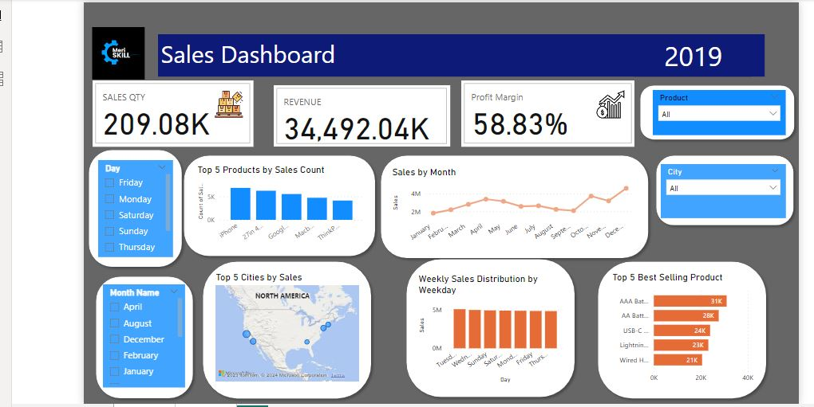

# Sales Analysis Report

## Project Objective:
The primary task involved a comprehensive analysis of sales data to discern trends, pinpoint top-selling products, and evaluate revenue metrics. This insightful exploration aims to provide valuable information for informed business decision-making.
 
Here's a basic outline to guide you through the process:
  ### Import Data
1. Launch Power BI Desktop.
2. Import the sales dataset.
 
### Data Cleaning / Data Transformation
1. Examine the dataset for missing values, duplicates, or anomalies.
2. Used Power Query Editor to clean the data (remove duplicates, fill missing values, etc.).
3. Ensure that columns have the correct data types (e.g., date columns).
 
### DAX Calculations / Data Visualization
- Use DAX (Data Analysis Expressions) to create measures such as total sales, profit margins.
- Building visuals using the fields and measures created.
- Arrange visuals on the canvas to create an interactive dashboard.
  
  
 
## Insights
 
1. Notably, the Macbook Pro Laptop, iPhone, and 34in Ultrawide Monitor emerge as high-performing products, signaling a demand for premium electronic devices.
2. Geographically, New York City, San Francisco, and Los Angeles stand out as key markets, suggesting the need for targeted marketing efforts in these areas. 
3. The dataset also reveals a peak in sales in the month of december.December exhibits a significant spike in sales, aligning with holiday shopping trends, highlighting the potential impact of seasonal marketing strategies.
 
## Key Statistics:
- Overall Sales: $34.5 million
- Quantity Ordered: 209.1 thousand units
- Product Categories: 19
- Monthly Sales Distribution: December emerged as the leading month with sales reaching $4.61 million.
- City with the Highest Sales: San Francisco
- Top Product by Quantity Ordered: AAA batteries (4-pack)
- Top Product by Sales Revenue: MacBook Pro Laptop
 
## Recommendations:
1. Introduce discounts in cities with lower revenue to stimulate sales.
2. Implement supplementary marketing strategies to expand reach and visibility.
3. Leverage the high sales month of December to introduce enhanced promotional campaigns, capitalizing on seasonal trends and consumer spending patterns.
